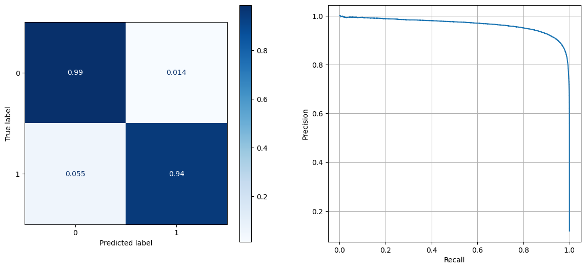

## Samokat.tech-Matching

**Перечень задач:**
- предстоит реализовать финальную часть пайплайна матчинга. В ней необходимо принять решение для каждой пары (товар предлагаемый продавцом — товар на площадке), является ли она матчем или нет (бинарная классификация).
- Для этого у каждой пары есть набор признаков и наборы векторов (картиночные и текстовые), которые описывают товары из этой пары.
- В качестве метрики качества решения используется _F-score_.

**Данные:** [источник](https://www.kaggle.com/competitions/binary-classification-offers-on-the-marketplace/data)

- `train.csv` - обучающий датасет. Содержит пары предложений и товаров, вероятность их мэтча, а так же другие параметры (id товаров, категория и др.)
- `test.csv` - датасет для итогового тестирования. Аналогичное содержание колонок, за исключения целевого признака.
- `sample_submission.csv` - пример файла предсказаний.

Каждое предложение и товар имеют изображение и название с атрибутами, которые в свою очередь представлены в векторном виде (эмбеддингах).
Embeddings:

- `goods_image_vectors` и `offer_image_vectors` - содержат файлы с векторами изображений (embed_deperson.npy) и их идентификаторами (items_deperson.npy) для товаров ассортимента и предложений соответственно. Объекты в файлах соотносятся 1 к 1.
- `goods_title_vectors` и `offer_title_vectors` - содержат файлы с векторами названий+атрибутов (embed_deperson.npy) и их идентификаторами (items_deperson.npy) для товаров ассортимента и предложений соответственно. Объекты в файлах соотносятся 1 к 1.

## Решение и вывод (кратко)

ML-моделей на базе CatBoost способна принимать решение не только на основе прогноза рескоринговой модели (которая имеет свою долю ошибок), но и равнозначно учитывать характеристики товаров (изображения, категории, цены товаров). Это наглядно продемонстрировано в таблице весов, назначенные признакам.

Отдельно стоит упомянуть, что фотографии товаров могут превысить значимость прогноза рескоринговой модели, если бы они существовали в бОльшем количестве. В исходном датасете лишь около 23% товаров имели изображения.

Максимальный результат **CatBoostClassifier**:
- Валидация     F1 = 0.92351
- Тест (public) F1 = 0.92625
- Тест (privat) F1 = 0.92632

Малая разница в оценке между различными выборками может говорить о хорошем результате обучения модели. Её прогноз стабилен. В качестве доработок для улучшения результата стоит провести консультацию с заказчиком для разбора аномалий и дефектов в данных и добавить новый признаки, к примеру: макс., мин. и медианная стоимость товара для каждой категории.

## Идеи для улучшений
- нарисовать блок-схему соотношений данных с помощью mermaid
- убрать заглушки в эмбеддингах (дубликаты) 
- убрать масштабирование эмбенддингов
- удалить эмбеддинги или оставить малую часть из них
- заполнить пробелы в цене товара медианой или средней ценой по категории